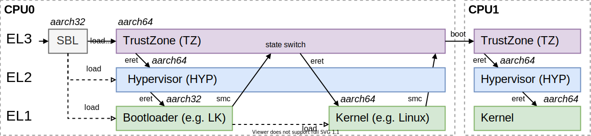
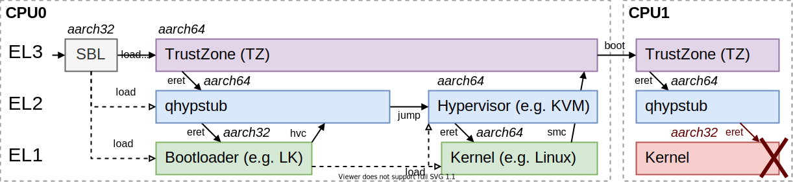
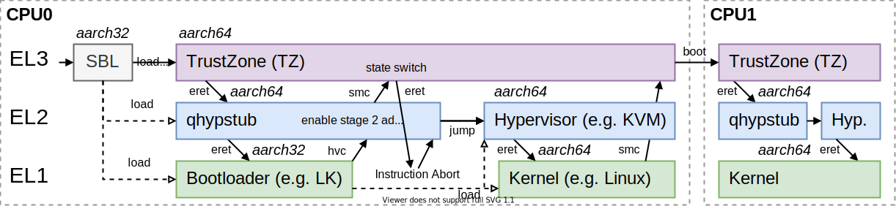

# qhypstub
[qhypstub] is a simple, open-source `hyp` firmware replacement for some Qualcomm SoCs
that allows using the virtualization functionality built into the ARM CPU cores.
Unlike the original (proprietary) `hyp` firmware from Qualcomm, it allows booting
Linux/KVM or other hypervisors in EL2. Note that it **does not implement any
hypervisor functionality**, it is just a _stub_ to "bridge the gap" between
the Qualcomm firmware and other hypervisors like KVM in Linux.

The following Qualcomm SoCs are known to work so far:

  - Snapdragon 410 (MSM8916/APQ8016)
  - Snapdragon 615 (MSM8939)

The same or similar approaches could likely work for many more similar SoCs from
Qualcomm (assuming the devices actually allow using custom hypervisor firmware).

**Advantages compared to the original firmware from Qualcomm:**

- Boot [Linux]/KVM or other operating systems in EL2 to enable virtualization functionality
- Directly boot 64-bit bootloaders without going through 32-bit [LK (Little Kernel)]
  - This works partially also with Qualcomm's `hyp` firmware, but breaks SMP/CPUidle there
    due to a bug in the proprietary PSCI implementation (part of TrustZone/TZ).
  - The workaround from qhypstup was also [ported to U-Boot](https://source.denx.de/u-boot/u-boot/-/commit/0204d1b56b2fa681d9f47c2fed0c626d48429151).
- Open-source
- Minimal runtime overhead (written entirely in assembly, 4 KiB of RAM required)

**Supported operating systems:**


- primary aarch64 bootloader (e.g. [U-Boot]) - started directly in EL2
- primary aarch32 bootloader (e.g. [LK (Little Kernel)]) - started in EL1
  - OS started in aarch64 EL2: requires [Try jumping to aarch64 kernel in EL2 using hypervisor call] patch applied to LK
  - OS started in aarch64 EL1: happens only when patch in LK is missing
  - OS started in aarch32 EL1 (e.g. original 32-bit Linux 3.10 kernel from Qualcomm)

**NOTE:** Replacing Qualcomm's hypervisor might break certain functionality and could have security implications.
Unfortunately, the responsibilities of the hypervisor in Qualcomm's system design are not clearly documented,
so [qhypstub] only implements the minimal functionality to make the device boot correctly.

## Installation
[qhypstub] is intended to be a drop-in replacement that is installed to the `hyp` partition (replacing the original
firmware from Qualcomm completely). However, this works only if the device has **secure boot disabled** and allows
using custom firmware. It is not entirely straightforward to check if this is the case:

- Firmware secure boot is completely unrelated to "bootloader unlocking" (which allows flashing custom Android
  boot images). Most Qualcomm devices available on the market have firmware secure boot enabled permanently,
  without a way to disable it.
- Some devices have "partial" secure boot, where only some of the firmware can be replaced.

If in doubt, assume that your device has secure boot enabled.

### Devices without secure boot
**WARNING:** The `hyp` firmware runs before the bootloader that provides the Fastboot interface. Be prepared to recover
your board using other methods (e.g. EDL) in case of trouble. DO NOT INSTALL IT IF YOU DO NOT KNOW HOW TO RECOVER YOUR BOARD!

After [building](#building) qhypstub and signing it, it is simply flashed to the `hyp` partition, e.g. using Fastboot:

```
$ fastboot flash hyp qhypstub-test-signed.mbn
```

**WARNING:** `qhypstub-test-signed.mbn` **works only on devices without secure boot**.

### Devices with secure boot
[lk2nd] is a fork of Qualcomm's open-source [LK (Little Kernel)] that can be packaged
into an Android boot image. This makes it easy to load it even on devices with enabled
secure boot, where the original bootloader (`aboot`) can not easily be replaced.

[lk2nd] supports a large number of devices based on MSM8916/MSM8939. It also contains
an implementation that abuses missing validation in some SCM/SMC calls of Qualcomm's
TZ firmware to load [qhypstub] at runtime. To load [qhypstub] via [lk2nd], use:

```
$ fastboot flash qhypstub qhypstub.bin
```

**Note:** In this case, the binary version (`qhypstub.bin`) is flashed to a "virtual"
`qhypstub` partition within [lk2nd]. DO NOT FLASH `qhypstub.bin` to the `hyp` partition!

After reboot, [lk2nd] will try to replace the original `hyp` firmware with [qhypstub]
at runtime. To disable [qhypstub] again, use:

```
$ fastboot erase qhypstub
```

Restoring a stock boot image will erase lk2nd along with the flashed `qhypstub` firmware.

For a short technical overview, see [Loading qhypstub at runtime](#loading-qhypstub-at-runtime).

## Building
[qhypstub] can be easily built with just an assembler and a linker, through the [Makefile](/Makefile):

```
$ make
```

Unless you are compiling it on a aarch64 system you will need to specify a cross compiler, e.g.:

```
$ make CROSS_COMPILE=aarch64-linux-gnu-
```

Even on devices without secure boot, the resulting ELF file must be signed with automatically generated test keys.
You can use [qtestsign], which will produce the `qhypstub-test-signed.mbn` that you flash to your device.

```
$ ./qtestsign.py hyp qhypstub.elf
```

**Tip:** If you clone [qtestsign] directly into your [qhypstub] clone, running `make` will also automatically sign the binary!

## Security
[qhypstub] is not a hypervisor and does therefore not attempt to prevent lower
exception levels (e.g. EL1 or EL0) to access its memory. Instead, the kernel
and/or hypervisor that you load MUST protect 4 KiB of memory, starting at
`0x86400000`, usually by marking it as reserved memory.

**Note:** On [Linux] this happens automatically because there is already 1 MiB
of memory reserved for Qualcomm's original `hyp` firmware.

## Technical overview
This section focuses on a technical overview of [qhypstub] and the functionality implemented
by the `hyp` firmware on MSM8916. For a general introduction for exception levels
(EL1/EL2/EL3 etc) and execution states, the following documentation may be helpful:

  - [Learn the architecture: AArch64 Exception model](https://developer.arm.com/documentation/102412/latest)
  - [Learn the architecture: AArch64 Instruction Set Architecture](https://developer.arm.com/documentation/102374/latest)
  - [Learn the architecture: AArch64 Virtualization](https://developer.arm.com/documentation/102142/latest)
  - [Learn the architecture: AArch64 memory management](https://developer.arm.com/documentation/101811/latest)
  - [ARM Architecture Reference Manual for Armv8-A]

It seems like the `hyp` firmware has only the following functionality on MSM8916:

  - Block EL2 to make sure it cannot be used (Why?)
  - Bring RPM out of reset
  - Enable stage 2 address translation to prevent EL1 from accessing EL2 memory(?)
    - Accessing hypervisor memory (1 MiB starting at 0x86400000) works with [qhypstub],
      but not with the original Qualcomm firmware.

Newer SoCs seem to implement more functionality in the `hyp` firmware (judging from the firmware size).
Unfortunately the features of the hypervisor firmware are not publicly documented. If you want to port
[qhypstub] to other SoCs you will need to investigate which functionality must be replicated,
and at least adjust the following constants:

  - `hyp` base address in `qhypstub.ld` (`0x86400000` on MSM8916)
  - RPM reset address in `qhypstub.s` (`0x01860000` on MSM8916)

A very basic `hyp` firmware is not Qualcomm-specific. The basic initialization sequence for EL2
is similar on all ARM processors. From there, many things can be derived based on trial and error.
The creation of [qhypstub] is documented in detail in the commit log.

If you have a primary aarch64 bootloader (e.g. [U-Boot]), an absolutely minimal `hyp` firmware that
ends up in [U-Boot] could be simply:

```assembly
.global _start
_start:
	mov	lr, 0x8f600000
	ret
```

where `0x8f600000` is the entry address of [U-Boot] (the firmware flashed to the
`aboot` partition). There is no need to load the bootloader from the internal storage,
since this already happens in SBL1. With this as a base, you can dump registers (= parameters) to memory,
light up a GPIO LED or something like this and investigate further.

Making it work properly is _a bit more complicated_ since it also gets called after
CPUs are powered back on (either on initial boot or after CPUidle). See `qhypstub.s`
and the commit log for more details.

### Boot flow
The boot flow with the original firmware from Qualcomm looks approximately like this
(somewhat simplified of course and perhaps specific to MSM8916 and similar older SoCs):



SBL runs in aarch32 state, loads and authenticates TZ/HYP/aboot and finally does
a CPU warm reset to switch to TZ in aarch64 state. TZ does some initialization and
then returns to the hypervisor (`hyp` firmware) in EL2. The `hyp` firmware gets the
entry address and execution state (aarch64 or aarch32) as parameters, does the EL2
initialization and then returns to the bootloader in EL1 (switching to aarch32 if
necessary).

[LK (Little Kernel)] runs in aarch32 mode and loads Android boot images from the eMMC.
But actually we want to boot aarch64 kernels (e.g. Linux). Since execution states can
only change when switching exception levels, LK needs to ask EL3 or EL2 to switch EL1
back to aarch64 state. For Qualcomm's original firmware this happens using a SMC
(Secure Monitor Call) to TZ.

Later, the loaded kernel might ask TZ (again with a SMC) to boot the other CPU cores.
Since the other CPU core is not initialized yet, basically the entire flow repeats again,
except that now TZ instructs the `hyp` firmware to boot directly in aarch64 state to the
entry point specified by the kernel. The same repeats over and over again whenever a CPU
was powered off (e.g. because of CPUidle).

#### Booting in EL2
With [qhypstub], the hypervisor/kernel is supposed to boot directly in EL2. This will allow
making use of the virtualization features built into the CPU. How do we do that?

[LK (Little Kernel)] cannot be booted in EL2 because the execution state switch to aarch32
can only happen when switching to a lower exception level (here: EL2 -> EL1). Also, LK
does not know how to deal with running at a higher exception level.

Instead, it is tempting to simply bypass TZ for the execution state switch entirely,
and implement a HVC (Hypervisor Call) that would switch to a aarch64 hypervisor/kernel
directly in EL2. I did this in [commit 75c75aa ("Implement HVC call to switch execution state to aarch64 in EL2")](https://github.com/msm8916-mainline/qhypstub/commit/75c75aa325f4f184c830bebfa8ca2d91eeb649cd).
It looks approximately like this:



[LK (Little Kernel)] is modified to try a HVC to jump to a aarch64 kernel before doing the SMC
(see [Try jumping to aarch64 kernel in EL2 using hypervisor call]), and then [qhypstub] simply
jumps to the entry point of the kernel directly in EL2.

This would be really nice and simple (especially when booting [U-Boot] directly as aarch64
bootloader!), but unfortunately it does not work properly, as you can see for CPU1. As mentioned,
TZ asks the `hyp` firmware to jump to an entry point in aarch32 or aarch64 state
(after EL2 initialization). For some reason, when implementing this approach, TZ suddenly
instructs the `hyp` firmware to jump to all entry points in aarch32 state, even though the kernel
was booted in aarch64 state.

At least on DragonBoard 410c, booting the other CPU cores happens using the standard
[Power State Coordination Interface (PSCI)]. This ends up as a standardized SMC to the
proprietary TZ firmware as shown in the diagram. (Unfortunately, Android devices based on MSM8916
implement some custom approach instead, but the idea is similar...)

It looks like there is a bug in the PSCI implementation within TZ that causes all other CPU cores
to be started in aarch32 state, unless the SMC for the initial state switch to aarch64 is invoked
(shown in the very first diagram!). Of course, since we control [qhypstub] we could simply ignore
if TZ tells us to jump to some entry point in aarch32 state, and always assume aarch64. But overall,
the TZ implementation is proprietary and there is no way to tell if not making TZ aware of the state
switch causes other problems later on.

#### Exception level ping-pong
To avoid the bug entirely, the SMC for the state switch in TZ must be invoked
at least once. This will make TZ aware that EL1 will be running in aarch64 execution state
from then on. Unfortunately, TZ does not involve the hypervisor when doing the state switch.
Even if the SMC is invoked from [qhypstub] (in EL2), TZ will attempt to return in EL1.
Oh well. :(

What we need is some kind of "exception level ping-pong", a way to jump back to EL2
immediately after TZ returns to EL1. There are many ways to implement this, we could
have TZ jump to some custom code in EL1, that would do a HVC back into EL2. But this
requires to save some registers etc. As a "hypervisor" in EL2, there must be some way
to prevent EL1 from running, right?

One solution for this is implemented in
[commit fb55f1e ("Use TZ SMC call to do aarch32 -> aarch64 execution state switch")](https://github.com/msm8916-mainline/qhypstub/commit/fb55f1e3821c991d1e7215a10f9ac9b00cf502f1).
It temporarily enables _stage 2 address translation_ immediately before starting the SMC.
Stage 2 address translation is the mechanism for the hypervisor to provide each virtual machine
with its own view of memory. In this case, it is just used as a dummy mechanism to effectively
forbid EL1 to access **any** memory.

This means that as soon as TZ returns to EL1, the CPU will immediately run into an
_Instruction Abort_ when trying to fetch the first instruction. This will force execution
back into EL2. Then, this exception is handled in [qhypstub] and it jumps to the
kernel directly in EL2. All in all, the boot flow for [qhypstub] looks approximately like this:



Because of the "PSCI bug", the boot flow when using [U-Boot] as primary aarch64 bootloader
actually looks very similar, except that the HVC is missing and instead the SMC is started
directly in [qhypstub], before starting any bootloader.

For more information about [qhypstub], take a look at the (quite detailed) commit log. :)

### Loading [qhypstub] at runtime
On the Black Hat USA 2017 conference, [Blue Pill for Your Phone] showed that the TZ firmware
on many older Qualcomm SoCs is missing checks for HYP memory in SCM/SMC calls. This makes it
possible to abuse some selected SCM calls to:

  - Zero out 4 consecutive bytes in HYP memory, or
  - Overwrite arbitrary amount of bytes in HYP memory with random data (PRNG).

This again can be used to corrupt boundary checks in Qualcomm's `hyp` firmware
which then allows mapping the entire HYP memory into EL1. Finally, [qhypstub]
is just copied into HYP memory region and will be used for all following CPU
warm boots (e.g. after CPUidle).

This was implemented independently by TravMurav in [lk2nd]:
https://github.com/msm8916-mainline/lk2nd/commit/4562184e245f0fdc429fd13600187090eed3e20d

## License
[qhypstub] is licensed under the [GNU General Public License, version 2]. It is mostly based on trial and error,
assembling it step by step until most things were working (see commit log). Since the Cortex-A53 is a standard
ARMv8-A CPU, the [ARM Architecture Reference Manual for Armv8-A] describes most of the registers that are used
to initialize EL2/EL1. Also, similar code can be found in [Linux] and [U-Boot].

[qhypstub]: https://github.com/msm8916-mainline/qhypstub
[Linux]: https://www.kernel.org
[LK (Little Kernel)]: https://git.linaro.org/landing-teams/working/qualcomm/lk.git
[U-Boot]: https://www.denx.de/wiki/U-Boot
[lk2nd]: https://github.com/msm8916-mainline/lk2nd
[Blue Pill for Your Phone]: https://www.blackhat.com/docs/us-17/wednesday/us-17-Bazhaniuk-BluePill-For-Your-Phone.pdf
[Try jumping to aarch64 kernel in EL2 using hypervisor call]: https://github.com/msm8916-mainline/lk2nd/commit/8d840ad94c60f1f5ab0a95e886839454e03d8b86.patch
[qtestsign]: https://github.com/msm8916-mainline/qtestsign
[GNU General Public License, version 2]: https://www.gnu.org/licenses/old-licenses/gpl-2.0.html
[ARM Architecture Reference Manual for Armv8-A]: https://developer.arm.com/documentation/ddi0487/latest/
[Power State Coordination Interface (PSCI)]: https://developer.arm.com/architectures/system-architectures/software-standards/psci
